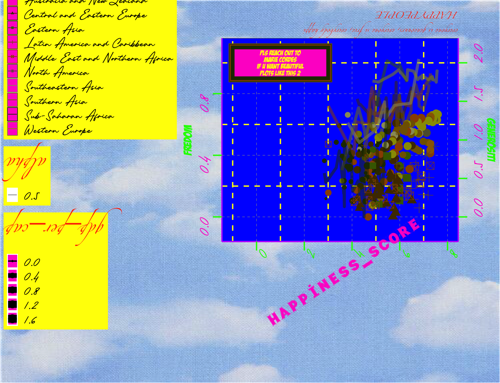

```{r setup, include=FALSE}
knitr::opts_chunk$set(echo = TRUE)
```

```{r load_packages, warning = FALSE, message = FALSE, include = FALSE}
library(extrafont)
library(tidyverse)
library(patchwork)
library(RColorBrewer)
library(treemapify)
library(ggalluvial)
library(ggridges)
library(ggthemes)
library(plyr)
library(dplyr)
library(lattice)
library(latticeExtra)
library(readr)
library(png)
library(ggpubr)
library(grid)
library(skimr)
library(janitor)
library(stats)
library(ggmap)
library(MASS)
library(ggplot2)
library(tibbletime)
library(magick)
library(magrittr)
library(ggtext)
library(gridExtra)
library(scales)
```


# Creating the *worst* possible visualisation

```{r load_data, warning = FALSE, message = FALSE}
# load data from csv
df <- read_csv(here::here("data", "world_happiness_2015.csv"))

# rename columns
names(df)[1] <- "country"
names(df)[2] <- "region"
names(df)[3] <- "happiness_rank"
names(df)[4] <- "happiness_score"
names(df)[5] <- "std_error"
names(df)[6] <- "gdp_per_cap"
names(df)[7] <- "family"
names(df)[8] <- "life_exp"
names(df)[9] <- "freedom"
names(df)[10] <- "govnm_corruption"
names(df)[11] <- "generosity"
names(df)[12] <- "dystopia_residual"
```

```{r inputs, warning = FALSE}
# define colours vector
colors <- c('#996600', '#4d3300', '#446600', '#806000', '#994d00', '#5c5c3d','#999966','#808000','#223300','#999900')

# load background picture
sky <- png::readPNG(here::here("data", "images", "sky.png"))

# define credits
label <- "pls reach out to\nMARIE CORDES\nif u want beautiful\nplots like this 2"
```

```{r plot, warning = FALSE}
# create plot
p <- ggplot(df, 
            aes(x = happiness_score, 
                color = region, 
                size = gdp_per_cap)) +
  # first y axis with data on freedom
        geom_point(aes(y=freedom)) +
  # set color scale to the one defined before
        scale_color_manual(values=colors)+

  #     theme_bw()+
  # add theme elements
        theme(
          # define general text size and font
          text = element_text(size=16, family="Piedmont"),
          
          # design titles
          title = element_text(angle = 180, 
                               color = "#ff3300", 
                               size = 8, 
                               family = "Zapfino"),
          # design axes titles
          axis.title.x = element_text(angle = 34, 
                                      color = "#ff33cc", 
                                      size=25, 
                                      family = "Typo Draft Demo"),
          axis.title.y = element_text(angle = 90, 
                                      color = "#00ff00", 
                                      size=18, 
                                      family = "BadaBoom BB"),
          # design axes text
          axis.text.x = element_text(angle = 77, 
                                     color="#00ff00", 
                                     size=15),
          axis.text.y = element_text(angle = 90, 
                                     color="#ff33cc", 
                                     size=15),
          # design axes lines and ticks
          axis.line = element_line(size = 1, 
                                   colour = "#bf00ff", 
                                   linetype = 1),
          axis.ticks = element_line(size = 1, 
                                    color = "#00ff00") , 
          axis.ticks.length = unit(.5, "cm"),
          # design grid lines
          panel.grid.major = element_line(size = 0.15, 
                                          linetype = 2,
                                          colour = "#ffff00"), 
          panel.grid.minor = element_line(size = 1, 
                                          linetype = 2,
                                          colour = "#ffff00"),
          # design plot and panel background
          plot.background = element_rect(fill = NA),
          panel.background = element_rect(fill = "#0000ff"),
          # design legend
          legend.position = "left",
          legend.title = element_text(size = 20),
          legend.background = element_rect(fill = "#ffff00")
          )+
        
  # add credits
        # add and design background rectangle
        geom_rect(aes(xmin = -1, xmax = 3, 
                      ymin = 0.9, ymax = 1.1), 
                  fill = "#ff33cc") +
        # add and design text
        geom_text(
          data = data.frame(
            x = 1, y = 1, 
            label = label),
          aes(x = x, y = y, 
              label = label),
          colour="#ffff00",
          family="BadaBoom BB",
          hjust = 0.5,
          lineheight = .8,
          inherit.aes = FALSE
          )+
        
  # add second y axis with data on generosity
        geom_point(aes(y = generosity, 
                       shape = region))+
  # add regression lines with data on life_exp
        geom_line(aes(y = life_exp, 
                      size = 0.1, 
                      alpha = 0.5))+
  # add axes limits
        scale_x_continuous(limits = c(-1,8))+
        scale_y_continuous(limits = c(-0.1,1.1),
                           # add left y axis name
                           name = "FREDOM",
                           # add second axis + name
                           sec.axis = sec_axis(~.*2, name = "generositi")) +
  # add title and subtitle
        labs(title = "HAPPY PEOPLE",
             subtitle = "everyone is geneouurs, everyone si free, everybody happi")+
NULL

```

Next we add a pretty background picture and, then, want to have a look at the final plot:

_Unfortunately, simply printing it, scales the picture very weirdly (probably even worse (=better) though)..._

```{r background, warning = FALSE, message = FALSE, results = "hide"}
# add background image
world_happiness_2015 <- grid.draw(gList(rasterGrob(sky, 
                                                   width = unit(1,"npc"), 
                                                   height = unit(1,"npc")), 
                                        ggplotGrob(p))) 
```

```{r save1, warning = FALSE, message = FALSE}
# save plot
world_happiness_2015 +
ggsave('worst_viz.png', height=28, width = 35, units = 'cm')
```

...therefore, we show it here, **in all its glory**!


